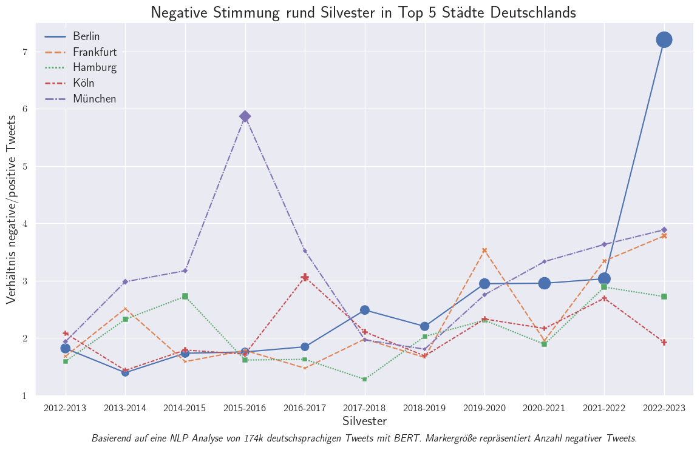

The NLP model is based on research by Guhr et al. (2020). See their [research paper](https://aclanthology.org/2020.lrec-1.202.pdf) and [code repository](https://github.com/oliverguhr/german-sentiment) for further information.
